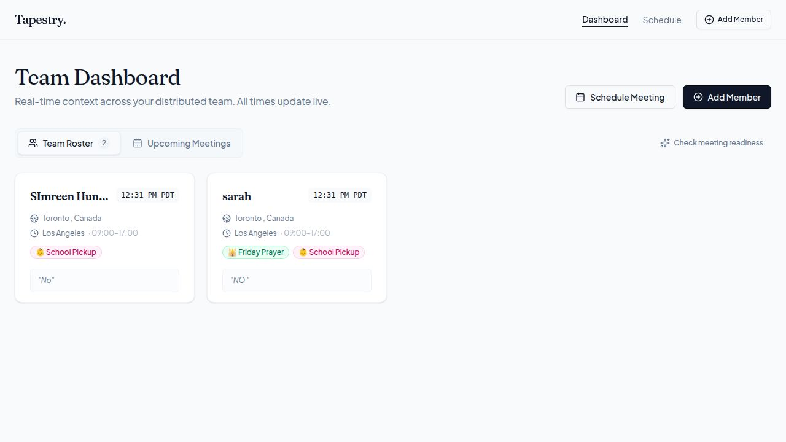

# Tapestry

> **See the threads. Understand the whole.**
> AI-powered meeting scheduling intelligence for globally distributed teams.

Tapestry helps managers answer a question that calendars can't: **not _can_ this meeting happen, but _should_ it?** It combines stored human context — religion, culture, caregiving, time zone, location — with live weather and calendar data, then uses GPT-4o to reason about whether *right now* is genuinely a good time to meet with a specific person.


---

## The problem

Every scheduling tool on the market knows **when** someone is free. None of them know **whether they're actually in a good state to meet.**

A 9 AM slot might be "open" on the calendar — but it's also school drop-off, the first day of Ramadan, a national holiday, or the middle of a heat wave with no power. That context is invisible to traditional tools, so meetings get booked at the wrong moments for the wrong people, and globally distributed teams quietly pay the price.

Tapestry makes that hidden context visible.

---

## Key features

- **Team Dashboard** — every teammate as a rich profile card with their *live* local time, work hours, and context tags (Friday Prayer, School Pickup, Shabbat, and more) derived from their profile.
- **Onboarding** — a friendly 3-step form to capture each person's basics, work schedule, and personal context.
- **Meeting Scheduler** — pick a time and attendees, and Tapestry returns a per-person **readiness signal** (🟢 Green / 🟡 Yellow / 🔴 Red), an overall recommendation, and alternative times.
- **Google Calendar integration** — upcoming meetings surface automatically, matched against your team so context appears before the meeting even starts.



---

## How it works

Tapestry is a context layer that sits between a manager and their calendar. Every readiness check pulls three normally-siloed types of data and routes them through a language model:

1. **Stored human context** — employee profiles (religion, culture, caregiving, health considerations, time zone, location) live in PostgreSQL. This is the baseline that rarely changes day-to-day.
2. **Live environmental signals** — current weather for each person's city is fetched in real time from OpenWeatherMap.
3. **Calendar data** — upcoming meetings are read via the Google Calendar API and matched to teammates by email.

All of this — profile + live conditions + the exact meeting date — is sent to **GPT-4o** with a date-specific prompt that reasons about a *specific moment* ("Is Ramadan active *on this date*?") rather than producing generic summaries. Calls run in parallel, one per attendee, to keep things fast.

---

## Tech stack

| Layer | Technology |
|-------|-----------|
| Frontend | React + Vite, Wouter, TanStack Query, Framer Motion |
| Backend | Express 5 (Node.js 24) |
| Database | PostgreSQL + Drizzle ORM |
| AI | OpenAI GPT-4o |
| Calendar | Google Calendar API (OAuth) |
| Weather | OpenWeatherMap API |
| Type safety | TypeScript end-to-end, Zod runtime validation, OpenAPI as the single source of truth (codegen via Orval) |
| Monorepo | pnpm workspaces |

A key architectural choice: the API contract is **defined in OpenAPI first**, which auto-generates both the frontend data-fetching hooks and the backend validation schemas. The frontend and backend stay in sync by definition.

---

## Project structure

```
artifacts/
  tapestry/        # React + Vite frontend
  api-server/      # Express API (employees, context-insight, calendar)
lib/
  db/              # Drizzle schema (source of truth)
  api-spec/        # OpenAPI spec (source of truth)
scripts/
  src/seed.ts      # Seeds demo employees
```

---

## Getting started

> Requires Node.js 24 and [pnpm](https://pnpm.io/). You'll also need a PostgreSQL database.

```bash
# 1. Install dependencies
pnpm install

# 2. Set environment variables (see below)

# 3. Push the database schema
pnpm --filter @workspace/db run push

# 4. Seed demo employees
pnpm --filter @workspace/scripts run seed

# 5. Run the API server
pnpm --filter @workspace/api-server run dev

# 6. Run the frontend (in a separate terminal)
pnpm --filter @workspace/tapestry run dev
```

### Environment variables

| Variable | Purpose | Required |
|----------|---------|----------|
| `DATABASE_URL` | PostgreSQL connection string | Yes |
| `OPENAI_API_KEY` | Powers the AI readiness analysis | For AI features |
| `OPENWEATHER_API_KEY` | Live weather signals | For weather context |

Google Calendar is connected via OAuth in the app (no key to paste).

> **Note:** Secrets are never committed to this repo — they live in environment variables only.

### Useful commands

```bash
pnpm run typecheck                                   # Full typecheck across all packages
pnpm --filter @workspace/api-spec run codegen        # Regenerate API hooks + Zod schemas from the OpenAPI spec
```

---

## Roadmap

Tapestry is an MVP and actively being built. Ideas on deck:

- Let employees edit and update their own context profiles
- Smart alerts before upcoming meetings
- Auto-refreshing meetings list
- A native mobile companion app

---

## About

Built by [Simreen Hundal](https://github.com/simreenhundal) — a student founder learning by building. Tapestry started from a simple observation: the best teams aren't the ones that meet the most, but the ones that meet at the *right* times, for the *right* people.

_Contributions, ideas, and feedback are welcome._
